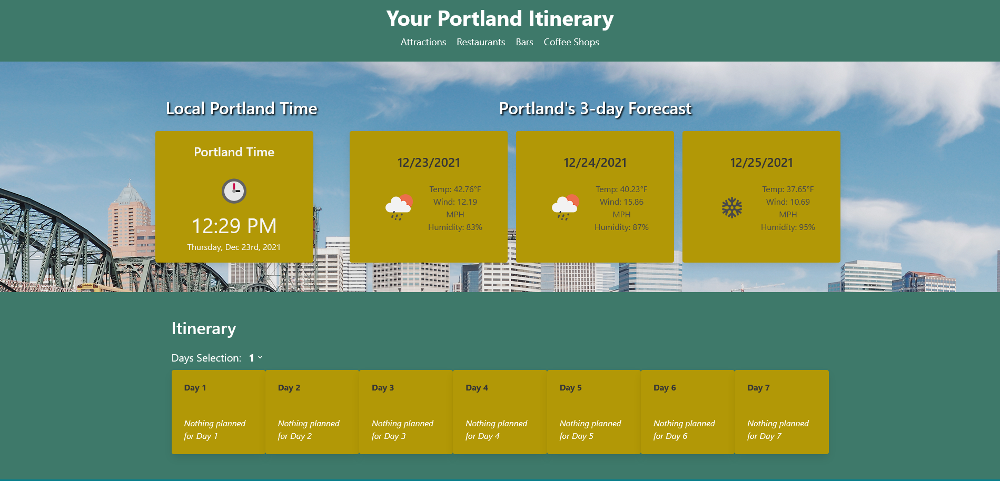

# Your Portland Itinerary 

## Screenshot

## Description
Travel planner for Portland Oregon.
#### Your Portland Itinerary
This is a travel website that can be used to help plan your trip to Portland, Oregon. The user can select specific travel dates. The user can then scroll through the site to view attractions, restaurants, bars, and coffee shops. Users can add activities to their travel itinerary. Users can also view the weather and current Portland time. 

## Technologies 
- HTML
- CSS
- JavaScript
- Moment.js
- Bulma
- jQuery

## URL

[Deployed Page](https://josephjamescoop.github.io/your-portland-itinerary/)

## Primary Contributors:
- [knharman](https://github.com/knharman)
- [JosephJamesCoop](https://github.com/JosephJamesCoop)
- [StaticCloud](https://github.com/StaticCloud)

## Known Bugs/Aspects That Need Work:
- Modal for adding event to a day is not responsive.
- Items in itinerary need an overhaul that translates easier to different screen sizes.
 
